# MSP Windows Infrastructure Troubleshooting & Automation Lab

A hands-on Windows infrastructure lab designed to simulate the type of work performed in a small MSP environment: building and supporting a Windows domain, validating core services, troubleshooting realistic incidents, documenting root cause, and converting repeatable support workflows into safe PowerShell diagnostics and controlled remediation.

## Project Goal

The project is built around a support-engineering workflow rather than a simple installation checklist:

1. Establish a known-good Windows infrastructure baseline.
2. Validate each dependency independently: networking, DNS, DHCP, authentication, Group Policy, and authorization.
3. Introduce realistic user and infrastructure incidents.
4. Troubleshoot from symptoms to root cause.
5. Verify each resolution from the end-user perspective.
6. Convert proven troubleshooting paths into reusable PowerShell diagnostics.
7. Add controlled remediation only where the change can be scoped, confirmed, and verified.
8. Document the work in a repeatable MSP ticket / knowledge-base format.

## Environment

- Oracle VirtualBox
- Windows Server 2025 Evaluation — `DC01`
- Windows 11 Enterprise Evaluation — `WIN11-01`
- Active Directory Domain Services (AD DS)
- DNS
- DHCP
- Group Policy
- SMB file sharing and NTFS authorization
- Windows networking
- PowerShell diagnostics and controlled remediation

## Lab Network

| Component | Configuration |
| --- | --- |
| Active Directory domain | `corp.lab` |
| Lab subnet | `10.10.10.0/24` |
| VirtualBox host-only adapter | `10.10.10.1` |
| Domain Controller / DNS / DHCP | `DC01` — `10.10.10.10` |
| Windows client | `WIN11-01` — DHCP |
| DHCP scope | `10.10.10.100-199` |
| Client DNS | `10.10.10.10` |

## Phase 1 — Infrastructure Baseline ✅

A functioning Windows domain environment was built and preserved as a known-good baseline before deliberate fault injection.

### Domain Controller and Core Services

`DC01` was configured with a static `10.10.10.10/24` address and promoted as the first domain controller for `corp.lab`. The server also hosts Active Directory-integrated DNS and Windows DHCP.

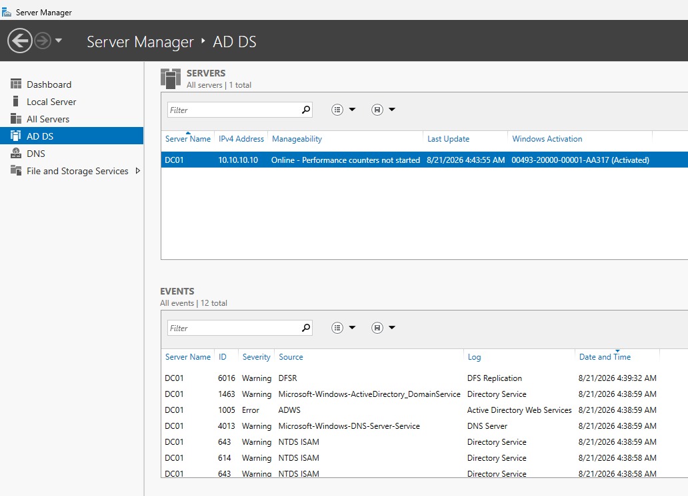

The `corp.lab` DNS zone provides the internal name-resolution and service-discovery foundation required by Active Directory clients.

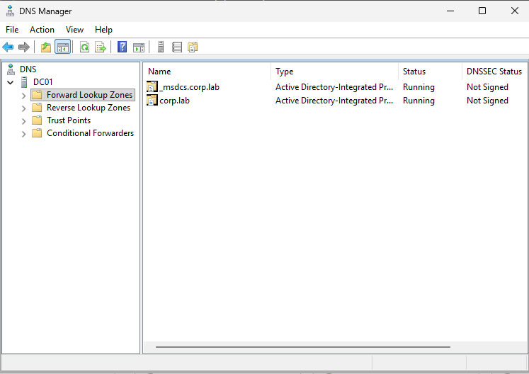

### Active Directory Organization

```text
corp.lab
├── CORP-Users
│   ├── Finance
│   ├── IT
│   └── Sales
├── CORP-Workstations
│   └── WIN11-01
├── CORP-Servers
└── CORP-Groups
    ├── GG-Finance
    ├── GG-IT
    └── GG-Sales
```

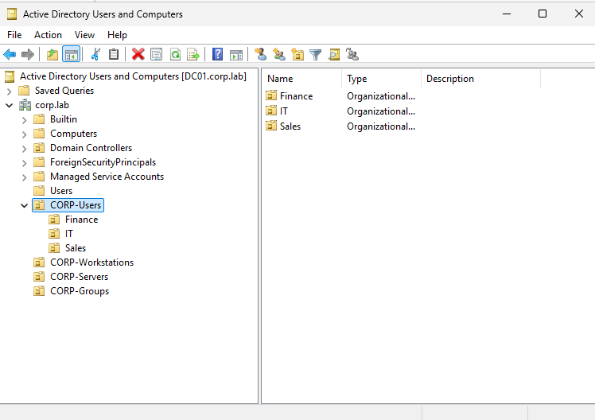

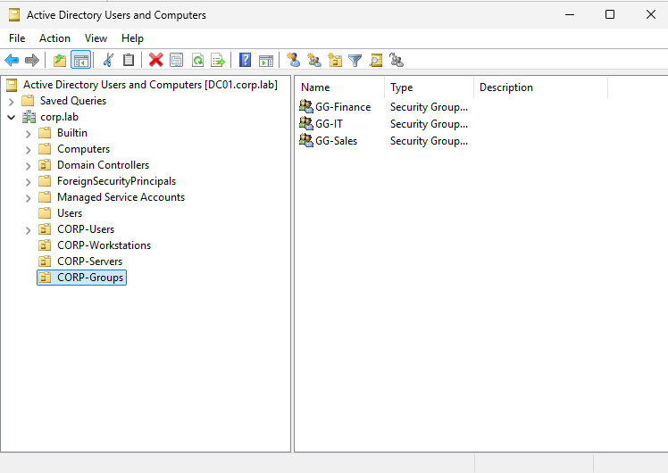

### DHCP and Client Network Configuration

Windows Server DHCP was authorized in Active Directory and configured with the workstation scope `10.10.10.100-199`.

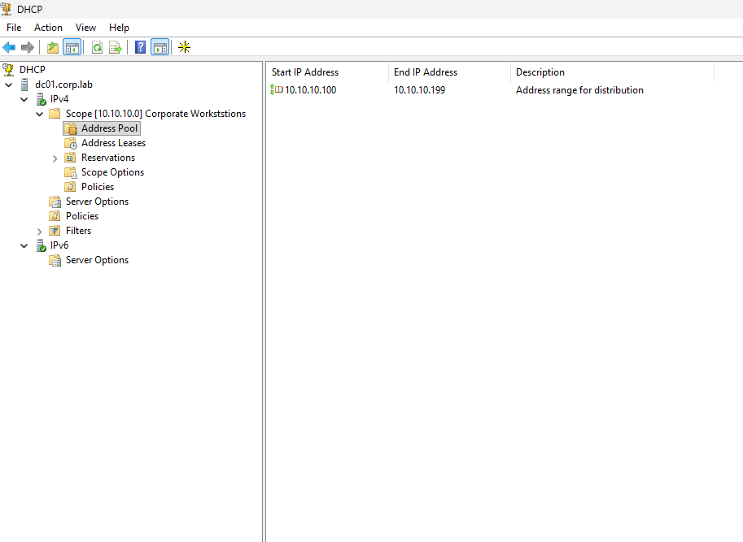

`WIN11-01` receives its IP configuration and domain DNS settings dynamically from `DC01`.

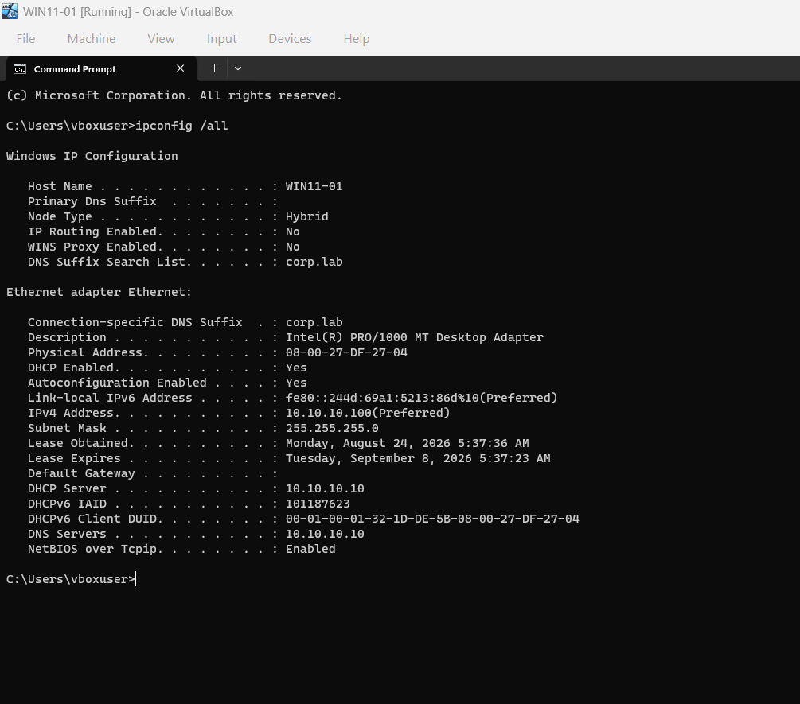

### Domain Join and Authentication

`WIN11-01` was joined to `corp.lab` and placed in `CORP-Workstations`.

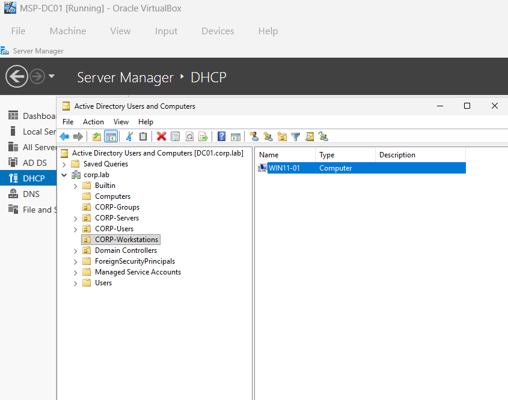

Domain authentication was validated with `CORP\amorgan` against `\\DC01` with expected group membership.

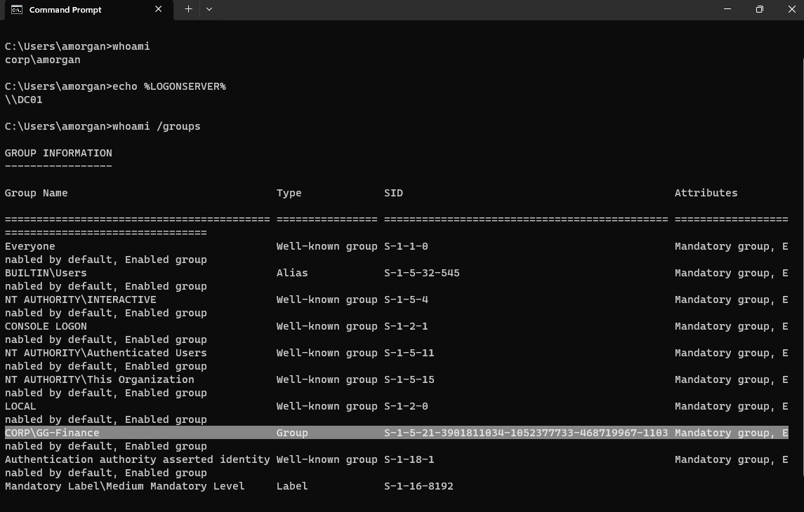

### Group Policy

A workstation GPO named `CORP Workstation Security Baseline` was linked to `CORP-Workstations`.

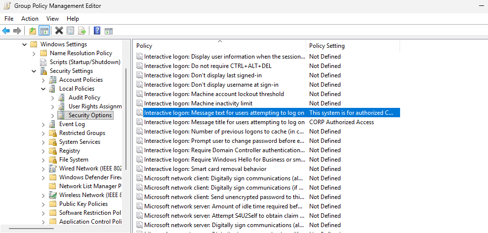

`gpresult` confirmed that the policy was applied from `DC01.corp.lab`, and the legal logon notice provided visible end-user verification.

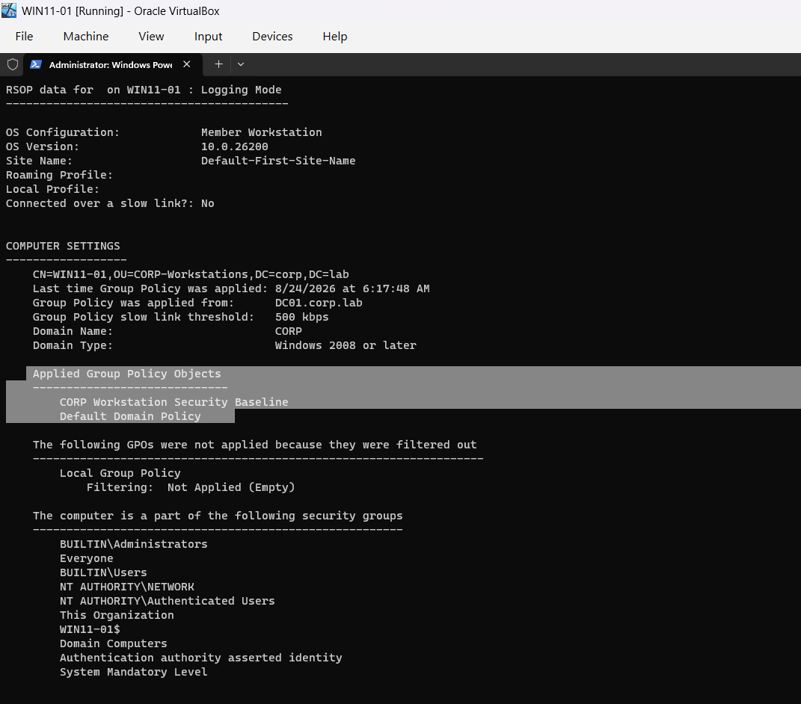

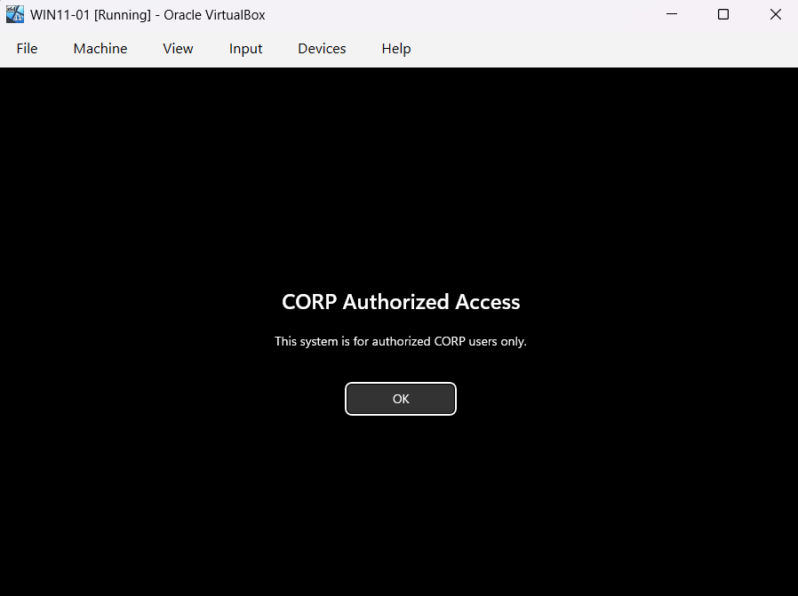

Healthy-state VirtualBox snapshots were created before deliberate incident simulation.

## Phase 2 — MSP Incident Simulation ✅

Five realistic incidents were reproduced, diagnosed, remediated, and documented using the same operational pattern:

**problem → symptoms → investigation → root cause → resolution → verification → automation opportunity**

### INC-001 — Active Directory Account Lockout

A Finance user was unable to sign in after repeated invalid password attempts. PowerShell confirmed the account remained enabled but had `LockedOut = True`. The account was unlocked and successful authentication was verified.

**Root cause:** the user exceeded the domain invalid-logon threshold.  
**Resolution:** validate the account state, unlock the approved account, and verify `LockedOut = False`.  
**Automation:** `Get-ADUserDiagnostic.ps1` + `Unlock-ADUserSafe.ps1`.

Full case study: [`incidents/INC-001-account-lockout/README.md`](incidents/INC-001-account-lockout/README.md)

### INC-002 — DNS Misconfiguration / Name-Resolution Failure

`WIN11-01` retained valid IP connectivity but was configured to use `8.8.8.8` instead of the domain DNS server. The workstation could reach `DC01` by IP while internal hostname and LDAP SRV lookups failed.

**Root cause:** the client pointed away from Active Directory-integrated DNS.  
**Resolution:** restore the expected domain DNS configuration and refresh client DNS state.  
**Automation:** `Get-NetworkDiagnostics.ps1` + `Repair-NetworkClient.ps1`.

Full case study: [`incidents/INC-002-dns-failure/README.md`](incidents/INC-002-dns-failure/README.md)

### INC-003 — DHCP Failure / APIPA

The `Corporate Workstations` DHCP scope was deliberately deactivated. `WIN11-01` failed to obtain a lease and self-assigned a `169.254.x.x` APIPA address, losing connectivity to `DC01`.

**Root cause:** the DHCP scope serving the workstation subnet was inactive.  
**Resolution:** reactivate the scope and renew the client lease.  
**Automation:** `Get-NetworkDiagnostics.ps1` detects APIPA; `Repair-NetworkClient.ps1` performs controlled client-side renewal once server-side DHCP is available.

Full case study: [`incidents/INC-003-dhcp-apipa/README.md`](incidents/INC-003-dhcp-apipa/README.md)

### INC-004 — Group Policy Application Failure

`WIN11-01` remained domain-joined but no longer received the expected workstation baseline because its computer object had been moved from `CORP-Workstations` into the default `Computers` container.

**Root cause:** the computer object was outside the OU where the GPO was linked.  
**Resolution:** return `WIN11-01` to `CORP-Workstations`, refresh Group Policy, and verify the expected GPO is applied.  
**Automation:** `Get-GPODiagnostic.ps1` + `Repair-GPOComputerScope.ps1`.

Full case study: [`incidents/INC-004-gpo-failure/README.md`](incidents/INC-004-gpo-failure/README.md)

### INC-005 — File Share / NTFS Permission Failure

`CORP\amorgan` could reach `DC01` but could not access the Finance share after the user's security token no longer contained the `GG-Finance` group required by the NTFS authorization model.

**Root cause:** the user lacked the required AD security-group membership.  
**Resolution:** restore `GG-Finance` membership, establish a fresh logon session, and verify access to `\\DC01\Finance`.  
**Automation:** `Get-FileAccessDiagnostic.ps1` + `Repair-FileAccessGroup.ps1`.

Full case study: [`incidents/INC-005-file-permissions/README.md`](incidents/INC-005-file-permissions/README.md)

## Phase 3 — PowerShell Diagnostics & Controlled Remediation ✅

The manual troubleshooting paths were converted into eight reusable PowerShell tools.

### Read-Only Diagnostics

- [`Get-ADUserDiagnostic.ps1`](powershell/diagnostics/Get-ADUserDiagnostic.ps1) — account state, password state, timestamps, distinguished name, and group membership
- [`Get-NetworkDiagnostics.ps1`](powershell/diagnostics/Get-NetworkDiagnostics.ps1) — IPv4, DHCP, APIPA, DNS, DC reachability, internal host lookup, and LDAP SRV discovery
- [`Get-GPODiagnostic.ps1`](powershell/diagnostics/Get-GPODiagnostic.ps1) — expected GPO application and workstation OU placement
- [`Get-FileAccessDiagnostic.ps1`](powershell/diagnostics/Get-FileAccessDiagnostic.ps1) — AD group membership, SMB share state, and NTFS authorization correlation

### Controlled Remediation

- [`Unlock-ADUserSafe.ps1`](powershell/remediation/Unlock-ADUserSafe.ps1) — validates account state, requires explicit approval, unlocks, and verifies
- [`Repair-NetworkClient.ps1`](powershell/remediation/Repair-NetworkClient.ps1) — controlled DNS correction and DHCP renewal with post-change validation
- [`Repair-GPOComputerScope.ps1`](powershell/remediation/Repair-GPOComputerScope.ps1) — confirms and restores a computer object to the expected workstation OU
- [`Repair-FileAccessGroup.ps1`](powershell/remediation/Repair-FileAccessGroup.ps1) — restores approved group-based access and reminds the technician to refresh the user's security token

### Safety Model

The remediation scripts deliberately avoid broad automatic repair. They follow a narrow change-control pattern:

1. inspect the current state
2. stop if no change is required
3. show the technician what will be changed
4. require explicit `YES` confirmation
5. apply only the supported remediation
6. re-query the environment and report the result

Detailed script documentation: [`powershell/README.md`](powershell/README.md)

Execution evidence: [`screenshots/README.md`](screenshots/README.md)

## Phase 4 — Ticket-Style Reporting / Knowledge Base ✅

The five incident case studies use a consistent documentation model so another technician can understand what happened without repeating the investigation from scratch.

The reusable workflow captures:

- ticket summary and affected user / system
- business impact and reported symptom
- environment and dependencies
- investigation sequence
- root cause
- exact resolution
- technical and end-user verification
- automation / prevention opportunity

Reusable template: [`documentation/TICKET-TEMPLATE.md`](documentation/TICKET-TEMPLATE.md)

Incident index: [`incidents/README.md`](incidents/README.md)

## Evidence

The repository contains visual evidence for the infrastructure baseline, all five incident simulations, and the PowerShell diagnostic / remediation phase.

- Phase 1 configuration evidence: `screenshots/`
- Incident evidence: `screenshots/incidents/`
- PowerShell evidence: `screenshots/powershell/`
- Full evidence index: [`screenshots/README.md`](screenshots/README.md)

## Repository Structure

```text
msp-windows-infrastructure-lab/
├── architecture/
│   └── README.md
├── documentation/
│   ├── phase-1-build.md
│   └── TICKET-TEMPLATE.md
├── incidents/
│   ├── README.md
│   ├── INC-001-account-lockout/
│   ├── INC-002-dns-failure/
│   ├── INC-003-dhcp-apipa/
│   ├── INC-004-gpo-failure/
│   └── INC-005-file-permissions/
├── powershell/
│   ├── README.md
│   ├── diagnostics/
│   │   ├── Get-ADUserDiagnostic.ps1
│   │   ├── Get-NetworkDiagnostics.ps1
│   │   ├── Get-GPODiagnostic.ps1
│   │   └── Get-FileAccessDiagnostic.ps1
│   └── remediation/
│       ├── Unlock-ADUserSafe.ps1
│       ├── Repair-NetworkClient.ps1
│       ├── Repair-GPOComputerScope.ps1
│       └── Repair-FileAccessGroup.ps1
└── screenshots/
    ├── README.md
    ├── incident evidence
    └── powershell/
```

## Completed Project Roadmap

1. **Infrastructure Baseline** — ✅ Complete
2. **INC-001: AD Account Lockout** — ✅ Complete
3. **INC-002: DNS / Name Resolution Failure** — ✅ Complete
4. **INC-003: DHCP Failure / APIPA** — ✅ Complete
5. **INC-004: Group Policy Failure** — ✅ Complete
6. **INC-005: File Share / Permission Failure** — ✅ Complete
7. **PowerShell Diagnostics** — ✅ Complete
8. **Controlled Remediation** — ✅ Complete
9. **Ticket-Style Reporting / Knowledge Base** — ✅ Complete

## Skills Demonstrated

- Windows Server administration
- Active Directory Domain Services
- user and group administration
- Group Policy troubleshooting
- DNS and DHCP troubleshooting
- TCP/IP and Windows client networking
- SMB shares and NTFS permissions
- root-cause analysis
- structured incident troubleshooting
- PowerShell diagnostics
- controlled remediation and validation
- technical documentation and knowledge-base writing
- support workflows designed for repeatability and handoff

## Documentation Philosophy

The project separates installation evidence, incident case studies, source code, and execution evidence so each layer can be reviewed independently.

The core principle is simple: **understand the failure manually first, automate only the repeatable part, and always verify the result.**

## Security

This repository contains only isolated lab configuration and sanitized evidence. Passwords, product keys, tokens, personal information, and unrelated host-system information are not intentionally committed.
