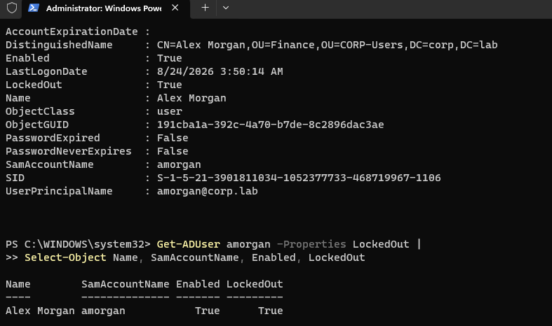
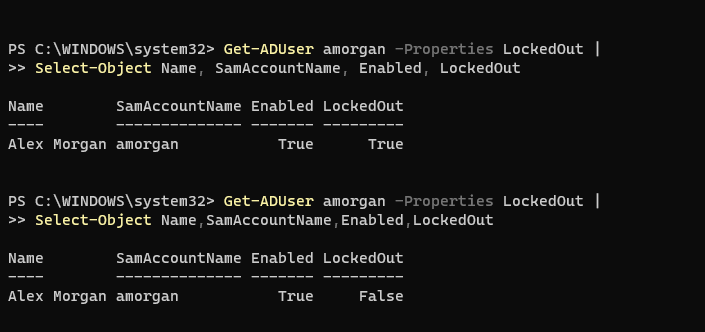
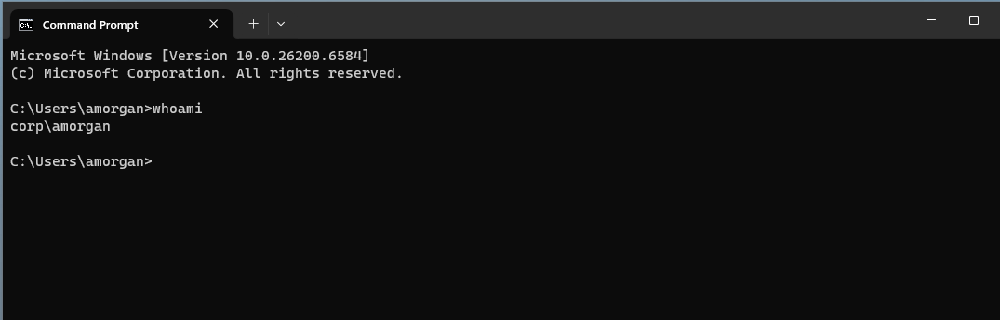

# INC-001 — Active Directory Account Lockout

## Ticket Summary

**User:** Alex Morgan  
**Username:** `amorgan`  
**Department:** Finance  
**Workstation:** `WIN11-01`  
**Domain:** `corp.lab`  
**Reported issue:** User is unable to sign in after multiple unsuccessful password attempts.

## Business Impact

The user cannot authenticate to the domain workstation and therefore cannot access the normal Windows session or domain resources.

## Environment

- Domain Controller: `DC01.corp.lab` / `10.10.10.10`
- Client: `WIN11-01`
- Identity provider: Active Directory Domain Services
- User OU: `CORP-Users/Finance`
- Security group: `GG-Finance`

## Symptoms

Windows displayed the message:

> The referenced account is currently locked out and may not be logged on to.


This confirms the end-user symptom, but the incident was still validated from the directory side before remediation.

## Investigation

The troubleshooting process followed the dependency chain rather than immediately resetting or modifying the account.

1. Confirm the workstation was already operating from the known-good Phase 1 network baseline.
2. Verify that the issue was isolated to the user account rather than a broader client, DNS, or domain-controller outage.
3. Query the Active Directory account to distinguish between an account that was disabled, expired, password-expired, or locked out.

PowerShell was used as a diagnostic check:

```powershell
Get-ADUser amorgan -Properties LockedOut |
Select-Object Name,SamAccountName,Enabled,LockedOut
```

The account was still enabled, but `LockedOut` returned `True`.



This distinction matters operationally: `Enabled = True` means the account itself is active, while `LockedOut = True` means Active Directory is temporarily refusing authentication because the account-lockout policy was triggered.

## Root Cause

`amorgan` exceeded the configured invalid-logon threshold after repeated incorrect password attempts. Active Directory locked the account as designed by the domain account-lockout policy.

## Resolution

After confirming the user's identity and the root cause, the account was manually unlocked through **Active Directory Users and Computers**.

The first incident was intentionally remediated manually so the administrative workflow is understood before automating the same action with PowerShell.

## Verification

The remediation was verified at two levels.

### Directory-state verification

The same PowerShell query was run again after the unlock. `LockedOut` changed from `True` to `False`.



### End-user verification

Alex then successfully signed back into `WIN11-01`. Running `whoami` returned:

```text
corp\amorgan
```



The incident was therefore considered resolved only after both the Active Directory state and the user-facing login were verified.

## Automation Opportunity

This incident exposes a repeatable service-desk workflow suitable for PowerShell diagnostics.

A future diagnostic tool can accept a username and report:

```text
User:           Alex Morgan
Username:       amorgan
Department:     Finance
Enabled:        True
Locked Out:     True
Password State: Valid
Groups:         GG-Finance

Diagnosis: Active Directory account is locked.
Recommended action: Verify user identity and unlock the account.
```

A later remediation function can offer an explicit technician-approved `Unlock-ADAccount` action rather than changing account state automatically.

## Skills Demonstrated

- Active Directory user administration
- Account-lockout policy behavior
- Authentication troubleshooting
- PowerShell-based identity diagnostics
- Differentiating enabled vs. locked account states
- Root-cause analysis
- Manual remediation
- Post-change verification
- Identification of a safe automation opportunity
