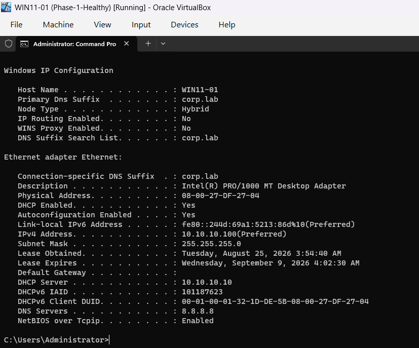
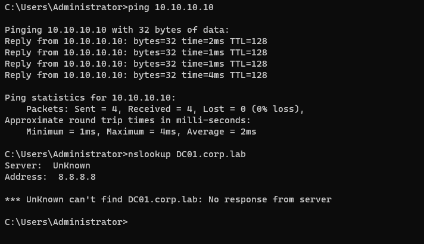
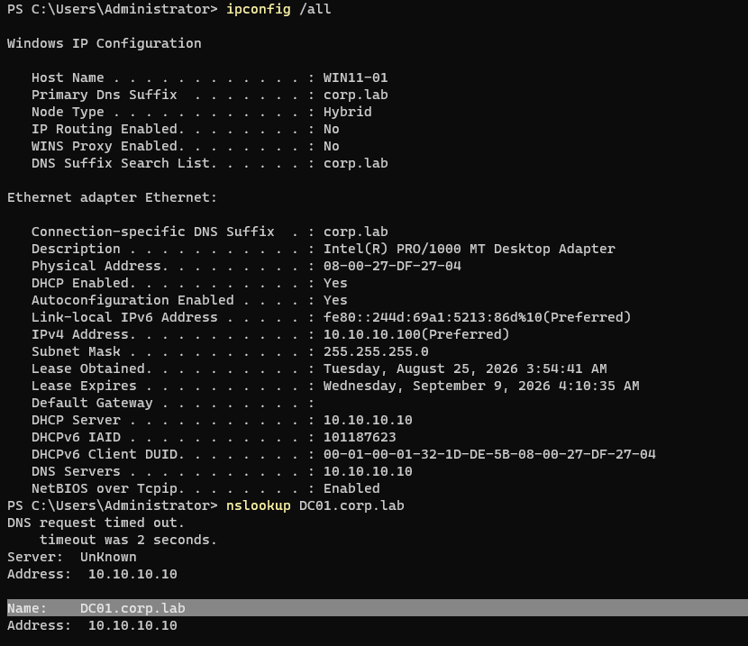

# INC-002 — DNS Misconfiguration / Active Directory Name-Resolution Failure

## Ticket Summary

**User:** Alex Morgan  
**Workstation:** `WIN11-01`  
**Domain:** `corp.lab`  
**Reported issue:** The workstation can reach the domain controller by IP address, but internal names and Active Directory service records do not resolve.

## Business Impact

The user still has basic IP connectivity, but domain-dependent operations can fail because the workstation cannot resolve the private `corp.lab` namespace or locate Active Directory services through DNS.

## Environment

- Domain Controller / DNS Server: `DC01.corp.lab` / `10.10.10.10`
- Client: `WIN11-01`
- Client addressing: DHCP
- Correct DNS source: Windows DHCP on `DC01`
- Correct client DNS: `10.10.10.10`

## Symptoms

The workstation retained a valid DHCP lease and could still communicate with `DC01` by IP address. However, DNS had been manually changed to `8.8.8.8`.



This created a useful troubleshooting contrast: Layer 3 connectivity was healthy while name resolution was broken.



## Investigation

The investigation separated network reachability from DNS resolution instead of treating the issue as a generic connectivity failure.

1. Confirmed `WIN11-01` still had a valid DHCP-assigned IPv4 address.
2. Confirmed the workstation could reach `10.10.10.10` directly by IP.
3. Tested `DC01.corp.lab` with `nslookup` and observed name-resolution failure.
4. Inspected the DNS client configuration and found `8.8.8.8` instead of the domain DNS server `10.10.10.10`.
5. Tested the Active Directory LDAP SRV record to confirm that AD service discovery was also failing.


## Root Cause

`WIN11-01` was configured to use the public resolver `8.8.8.8` instead of the Active Directory-integrated DNS server on `DC01`.

Public DNS resolvers have no knowledge of the private `corp.lab` namespace or its Active Directory SRV records. As a result, the workstation could still communicate by IP address but could not reliably locate domain resources or domain-controller services by name.

## Resolution

The workstation DNS configuration was returned to **Obtain DNS server address automatically** so that Windows DHCP could again supply `10.10.10.10`.

The client DNS cache was then flushed and the network lease refreshed before retesting.

```cmd
ipconfig /flushdns
ipconfig /renew
```

## Verification

The remediation was verified by confirming that the workstation again used `10.10.10.10` for DNS and that internal name resolution succeeded.



Successful verification demonstrated that:

- IP connectivity to `DC01` remained healthy;
- `DC01.corp.lab` resolved through the domain DNS server; and
- Active Directory DNS service discovery was restored.

## Troubleshooting Lesson

A successful ping to an IP address does not prove that Active Directory connectivity is healthy. In a Windows domain, DNS is a core infrastructure dependency because clients use DNS records to locate domain controllers and services.

The key diagnostic pattern was:

```text
IP connectivity:      Working
Internal DNS:         Failing
AD SRV discovery:     Failing
Client DNS server:    Incorrect
```

That narrowed the fault domain quickly and avoided unnecessary changes to the server, domain account, or network adapter.

## Automation Opportunity

This workflow is suitable for a future PowerShell diagnostic script that can:

- report the client's IPv4, DHCP, and DNS configuration;
- compare the configured DNS server against the expected domain DNS server;
- test reachability to the domain controller by IP;
- test `Resolve-DnsName` for the domain controller; and
- test Active Directory SRV records before recommending remediation.

A technician-approved remediation step could optionally restore DHCP-provided DNS and flush the resolver cache.

## Skills Demonstrated

- Windows DNS client troubleshooting
- Active Directory DNS dependencies
- DHCP vs. manually overridden DNS configuration
- Layer 3 connectivity isolation
- `nslookup` and SRV-record validation
- Root-cause analysis
- Controlled remediation
- Post-change verification
- Identification of a PowerShell automation opportunity
