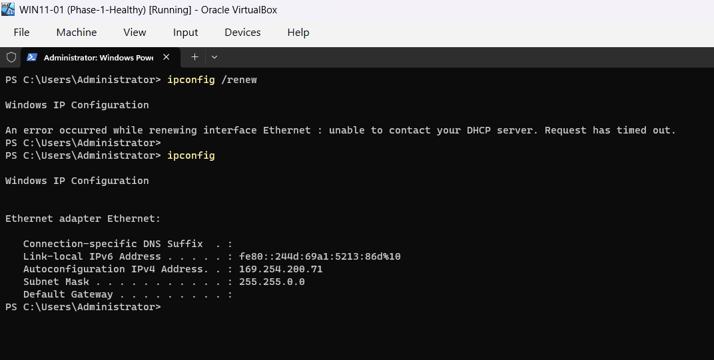
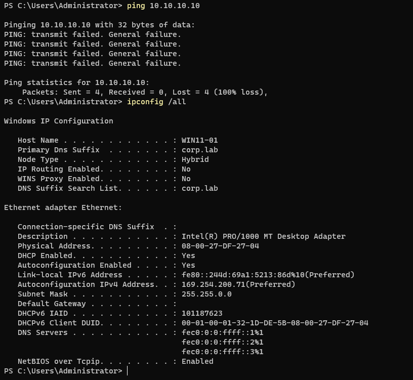
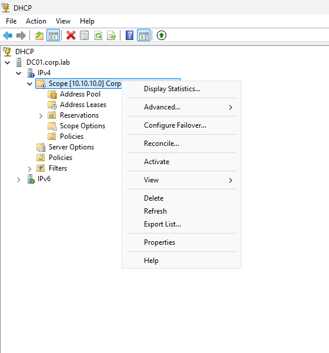
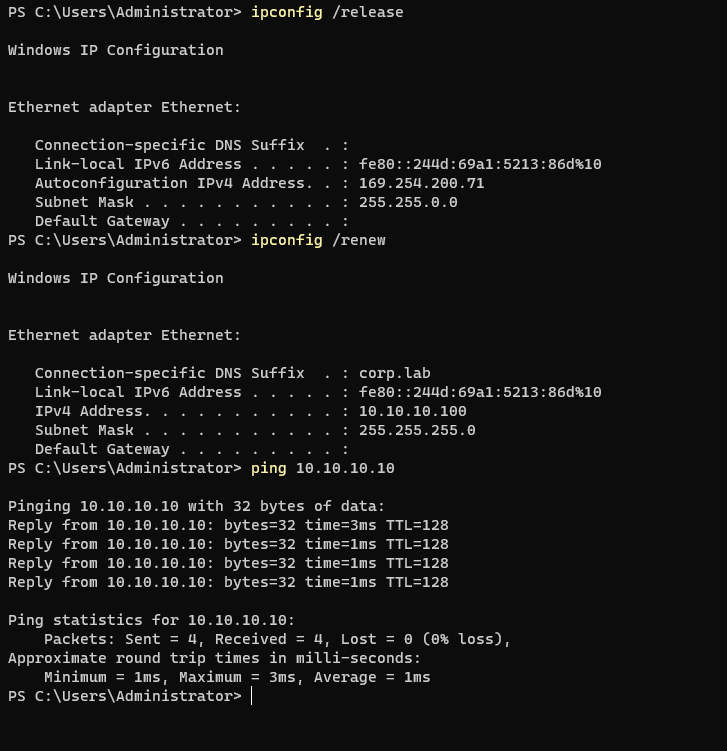

# INC-003 — DHCP Failure / APIPA

## Ticket Summary

**Workstation:** `WIN11-01`  
**Domain:** `corp.lab`  
**DHCP Server:** `DC01` / `10.10.10.10`  
**Reported issue:** Workstation cannot reach domain resources and does not receive its normal corporate IP configuration.

## Business Impact

The affected workstation loses normal network access to the domain because it does not receive a valid lease from the Windows DHCP server. Without a usable `10.10.10.0/24` address, the client cannot reliably communicate with `DC01`, use domain DNS, or access domain services.

## Symptoms

After the DHCP scope was deliberately deactivated and the client lease was released, `WIN11-01` failed to obtain a new DHCP lease and self-assigned an APIPA address in the `169.254.0.0/16` range.



The client remained configured for DHCP, but connectivity to `DC01` failed because the workstation no longer had an address on the `10.10.10.0/24` lab subnet.



## Investigation

The troubleshooting process focused on whether the problem was local adapter configuration, DNS, or DHCP lease assignment.

The APIPA address was the key diagnostic indicator. Windows normally self-assigns a `169.254.x.x` address when an interface is configured for DHCP but cannot obtain a valid lease.

Because the workstation was still set to obtain an IP address automatically, the next check was the Windows DHCP server configuration on `DC01`.

DHCP Manager showed that the `Corporate Workstations` scope was inactive.



This explained why the client DHCP discovery/renewal process could not obtain a usable lease.

## Root Cause

The `Corporate Workstations` DHCP scope on `DC01` was deactivated. As a result, the DHCP server did not offer a lease to `WIN11-01` when the client attempted to renew its network configuration.

With no DHCP lease available, Windows automatically assigned an APIPA address in the `169.254.0.0/16` range. That address was outside the lab's `10.10.10.0/24` subnet and prevented normal communication with the domain controller.

## Resolution

The `Corporate Workstations` scope was reactivated in Windows DHCP Manager.

On `WIN11-01`, the client configuration was then refreshed with:

```cmd
ipconfig /release
ipconfig /renew
```

The workstation successfully obtained a valid DHCP lease again, including the expected corporate IP configuration and domain DNS settings.

## Verification

Post-remediation verification confirmed that the workstation had returned to the correct network state and could reach `DC01` again.



The incident was considered resolved only after confirming both successful lease assignment and restored connectivity.

## Troubleshooting Logic

```text
DHCP-enabled client
      ↓
169.254.x.x APIPA address
      ↓
No valid DHCP lease received
      ↓
Inspect DHCP server / scope state
      ↓
Scope inactive
      ↓
Reactivate scope and renew lease
      ↓
Valid 10.10.10.x address restored
```

## Automation Opportunity

This incident is a strong candidate for a PowerShell network diagnostic workflow. A future script could:

- identify active adapters,
- determine whether DHCP is enabled,
- flag APIPA addresses,
- display DHCP and DNS server configuration,
- test reachability to the expected domain controller,
- attempt a controlled lease renewal, and
- return a concise technician-facing diagnosis.

Server-side diagnostics could also check whether the expected DHCP scope is active and whether leases are being issued.

## Skills Demonstrated

- Windows DHCP administration
- DHCP lease troubleshooting
- APIPA recognition and interpretation
- Layer 3 connectivity diagnosis
- Windows Server DHCP scope management
- Structured root-cause analysis
- Client-side remediation and verification
- Identification of a PowerShell automation opportunity
