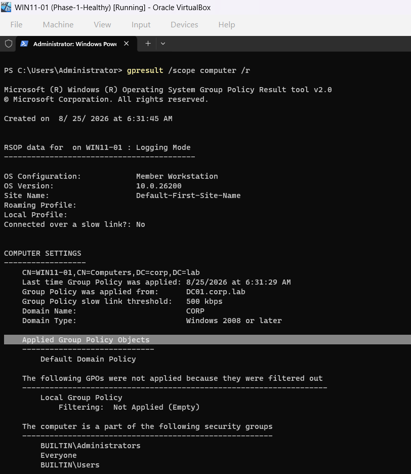
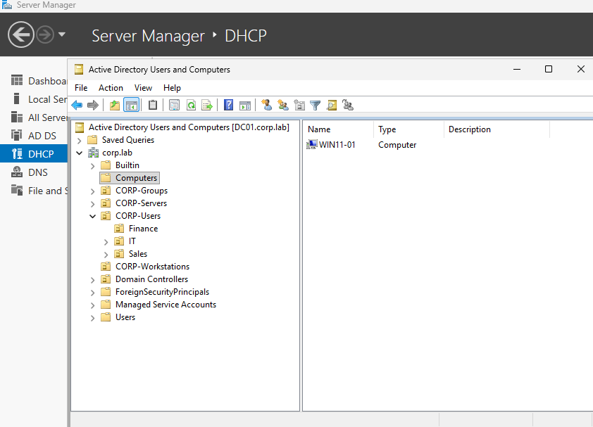
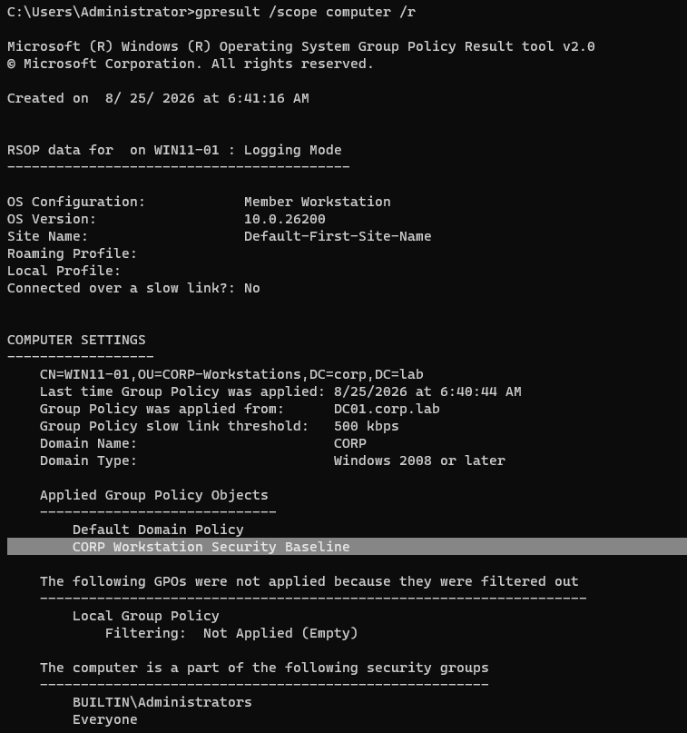

# INC-004 — Group Policy Application Failure

## Ticket Summary

**Affected workstation:** `WIN11-01`  
**Technician account:** `CORP\Administrator`  
**Affected user context:** `CORP\amorgan`  
**Domain:** `corp.lab`  
**Reported issue:** Expected workstation security settings were no longer being applied to the domain-joined Windows 11 client.

## Business Impact

The workstation remained online and domain-joined, but the expected security baseline was no longer enforced. In a production environment, this could leave a managed endpoint outside required configuration, security, or compliance policy.

## Environment

- Domain Controller: `DC01.corp.lab` / `10.10.10.10`
- Client: `WIN11-01`
- GPO: `CORP Workstation Security Baseline`
- Intended OU: `CORP-Workstations`
- Fault location: default `Computers` container

## Symptoms

The client could still communicate with the domain controller and authenticate to the domain, but `gpresult /scope computer /r` no longer listed `CORP Workstation Security Baseline` under Applied Group Policy Objects.



This ruled out a total domain or network outage and narrowed the problem to Group Policy scope or processing.

## Investigation

The workstation's computer object was inspected in Active Directory Users and Computers. `WIN11-01` had been moved out of `CORP-Workstations` and into the default `Computers` container.



The workstation security GPO was linked to `CORP-Workstations`, so moving the computer object outside that OU placed it outside the GPO's scope.

This distinction is important: the workstation was still domain-joined and reachable, but Group Policy application depends on where the computer object resides in Active Directory and which GPO links apply to that location.

## Root Cause

`WIN11-01` was located in the default `Computers` container instead of the `CORP-Workstations` OU. Because `CORP Workstation Security Baseline` was linked to `CORP-Workstations`, the workstation no longer fell within the GPO's scope.

## Resolution

The `WIN11-01` computer object was moved back into `CORP-Workstations` in Active Directory Users and Computers.

The client then refreshed Group Policy with:

```cmd
gpupdate /force
```

and the workstation was restarted so computer-side policy processing could complete cleanly.

## Verification

After remediation, `gpresult /scope computer /r` once again listed `CORP Workstation Security Baseline` under Applied Group Policy Objects.



The incident was considered resolved only after the expected policy was confirmed on the endpoint rather than assuming that moving the computer object was sufficient.

## Troubleshooting Logic

```text
Domain authentication works
        ↓
DC connectivity works
        ↓
Expected GPO is missing
        ↓
Check GPO scope and computer location
        ↓
WIN11-01 is outside CORP-Workstations
        ↓
Move computer back to correct OU
        ↓
Refresh policy and verify with gpresult
```

## Automation Opportunity

A future PowerShell diagnostic could collect the workstation's distinguished name, identify its current OU, query applied Group Policy results, and compare the device location against the expected management OU.

Useful commands for a later automation phase include:

```powershell
Get-ADComputer WIN11-01 -Properties DistinguishedName
Get-GPResultantSetOfPolicy
```

A diagnostic script could flag a workstation whose AD location does not match the OU expected for its role before a technician manually changes anything.

## Skills Demonstrated

- Group Policy troubleshooting
- Active Directory OU and GPO scope concepts
- `gpresult` validation
- Computer-object administration
- Distinguishing connectivity/authentication from policy-processing failures
- Structured root-cause analysis
- Manual remediation and post-change verification
- Identification of a PowerShell automation opportunity
