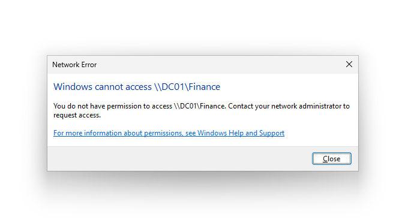
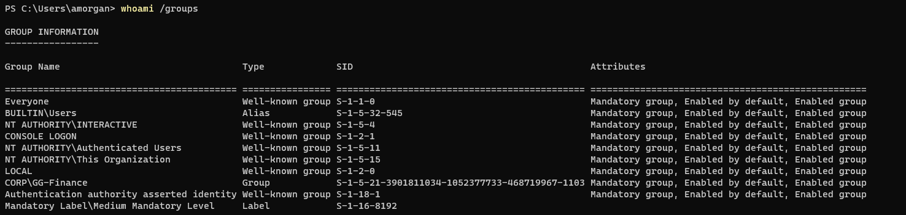
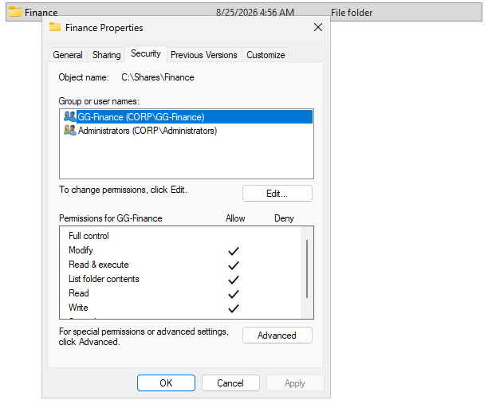
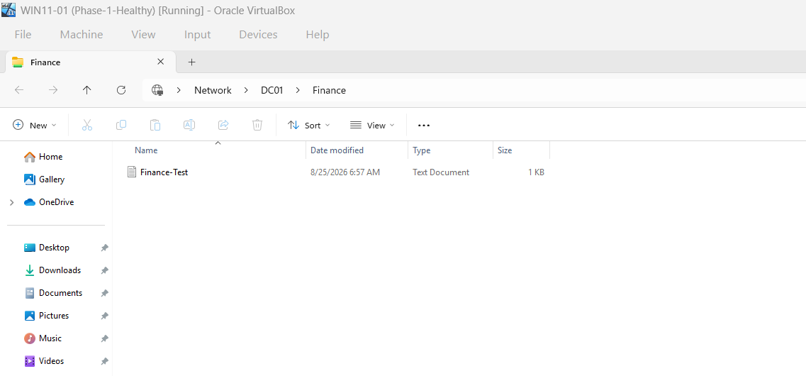

# INC-005 — File Share / NTFS Permission Failure

## Incident

**ID:** INC-005  
**Reported issue:** Finance user cannot access the Finance departmental share.  
**Affected user:** `CORP\amorgan`  
**Affected resource:** `\\DC01\Finance`

## Problem

A Finance user reported an access-denied error when opening the departmental file share. The server remained reachable and the share itself was online, so the investigation focused on authorization rather than general network availability.



## Investigation

Basic connectivity and name resolution to `DC01` were healthy, which ruled out the DNS and DHCP failure modes reproduced in earlier incidents.

The user security token was inspected with:

```cmd
whoami /groups
```

`CORP\GG-Finance` was not present in the user's current group list.



The server-side ACL on `C:\Shares\Finance` was then reviewed. Departmental access was intentionally controlled through the `GG-Finance` Active Directory security group rather than by assigning permissions directly to individual users.



During testing, broad or inherited permissions and the user's existing logon token were also considered because either can make a removed user appear to retain access. The final test state used an ACL where ordinary Finance access depended on `GG-Finance` and a fresh user logon token.

## Root Cause

`amorgan` did not have the `GG-Finance` group membership required by the Finance folder's NTFS authorization model. Because the share was reachable but the user's security token did not contain the required group SID, Windows denied access to the resource.

## Resolution

1. Restored `amorgan` to the `GG-Finance` Active Directory security group.
2. Signed the user out and back in so Windows issued a new logon token containing the updated group membership.
3. Retested access to `\\DC01\Finance`.

## Verification

The user could access the Finance share again after group membership was restored and a new logon session was established.



The incident was considered resolved only after the original resource was successfully opened from `WIN11-01`.

## Technical Takeaways

- Successful connectivity to a server does not imply authorization to every resource on that server.
- Share permissions and NTFS permissions are evaluated together; the effective result is the most restrictive combination.
- Group-based access is easier to audit and maintain than assigning permissions directly to users.
- Active Directory group membership changes generally require a new user logon token before the endpoint reflects them.
- Broad inherited entries such as `Users`, `Authenticated Users`, or `Everyone` can unintentionally bypass a group-based authorization design and should be reviewed during access troubleshooting.

## Automation Opportunity

A future PowerShell diagnostic workflow could:

- query a user's AD group memberships,
- inspect the current security token,
- retrieve SMB share permissions,
- retrieve NTFS ACLs with `Get-Acl`,
- compare required groups with effective user membership,
- report likely authorization gaps without automatically changing permissions.

This would automate evidence collection while keeping permission changes as a controlled administrative action.
